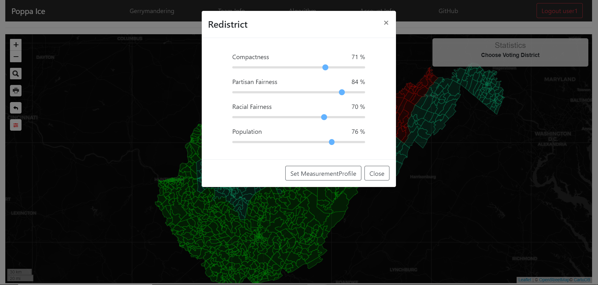
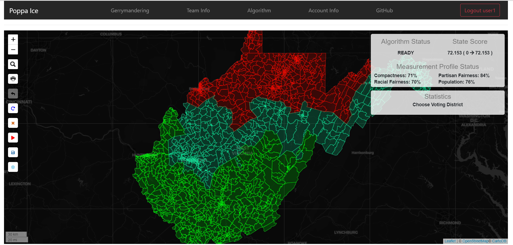

# district-gen
This is a school final team project in CSE major of SUNY at Stony Brook. 

This application was designed for gerrymandering based on 3 states, Maryland, Virginia, and West Virginia.

## How to play "district-gen"
1. Unzip GeoJson files
```
- Unzip 'district-gen\src\main\frontend\src\assets\stateBoundaries.zip' to 'district-gen\src\main\frontend\src\assets' directory.

- Unzip 'district-gen\src\main\resources\mapdata.zip' to 'D:\district-gen\src\main\resources\mapdata' directory.
```
2. Install node package modules
```
- In the terminal, move to 'district-gen\src\main\frontend' directory.

- type 'npm install'
```
3. Build node package modules
```
- In the terminal, move to 'district-gen\src\main\frontend'

- type 'npm run build'
```
4. Run Spring application
```
You may use Intellij IDEA to run this application.
```

### scenario 1 : Main Screen Before Login

```
Main display before login.
```

### scenario 2 : Main Screen After Login

```
Main display after login as a user.

# User ID/PW
ID: user1
PW: user1pw

# Admin ID/PW
ID: admin1
PW: admin1pw
```

### scenario 3 : Choose State and Display Congressional Districts

```
View for Congressional District.
```

### scenario 4 : Set Specific Measurement Profile for Redistricting

```
Set measurement profile to set redistricting options.
```

### scenario 5 : Playmode Before Start Redistricting

```
Default view for playmode.
```

### scenario 6 : Running Redistricting

```
Running redistricting algorithm.
```

### scenario 7 : Terminated Redistricting

```
Finish redistricting algorithm.
```

### scenario 8 : Display User Information Modal

```
View user information modal. There are 3 taps for this modal.

#Setting
1. Shows user information
2. Update user password

#History
1. Load/Delete saved measurement profile.

#Admin (Only for admin)
1. Shows web statistics
2. Edit/Delete/Create User
```
